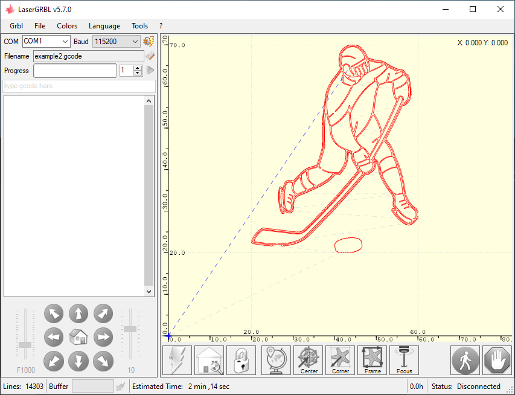

# Laser Engraving G-code Generation Tools

This repository contains tools for converting SVG and PNG images to G-code for use with laser engravers. This project was created to support hobbyists and professionals in laser engraving, providing an easy way to convert common file formats to G-code.

## svg_to_gcode.py

Converts SVG paths to G-code.

### Usage

```bash
python svg_to_gcode.py <svg_file_path> <output_gcode_path> --power=<laser_power> --feed_rate=<engraving_speed> --longest_side=<max_length_of_cut> --center_offset=<X_offset,Y_offset>
```

- `<svg_file_path>`: Path to the input SVG file.
- `<output_gcode_path>`: Path to save the generated G-code.
- `--power`: Laser power setting (default 1000).
- `--feed_rate`: Feed rate (speed) for engraving (default 1000).
- `--longest_side`: Optional. Length of the longest side of the engraving in millimeters.
- `--center_offset`: Optional. X and Y offset in millimeters to center the cut.

## image_to_gcode.py

Converts PNG images to G-code by tracing the image contours.

### Usage

```bash
python image_to_gcode.py <image_path> <output_gcode_path> --power=<laser_power> --feed_rate=<engraving_speed> --longest_side=<max_length_of_cut> --center_offset=<X_offset,Y_offset> --threshold=<threshold_level>
```

- `<image_path>`: Path to the input .png image file.
- `<output_gcode_path>`: Path to save the generated G-code.
- `--power`: Laser power setting (default 1000).
- `--feed_rate`: Feed rate (speed) for engraving (default 1000).
- `--longest_side`: Optional. Length of the longest side of the engraving in millimeters.
- `--center_offset`: Optional. Center offset (X, Y) in millimeters to align the center of the scaled cut.
- `--threshold`: Optional. Thresholding level for processing the image (default uses adaptiveThresholding).

## Installation and Environment Setup

Clone the repository and navigate to the repository directory:

```bash
git clone https://github.com/Khlick/gcode-converter.git
cd gcode-converter
```
To use these tools, we recommend creating a Python environment using `venv` or `conda`. Activate the environment and install the required Python packages.

### Using `venv`

```bash
python -m venv venv
source venv/bin/activate  # On Windows use `venv\Scripts\activate`
pip install -r requirements.txt
```

### Using `conda`

```bash
conda create --name myenv python=3.8
conda activate myenv
conda install --file requirements.txt
```

---

## Examples

### Converting an SVG to G-code

Produce a cut of the following svg:


```bash
python svg_to_gcode.py img/example.svg gcode/example1.gcode --power 1000 --feed_rate 600 --longest_side 45 --center_offset (40,40)
```
Produces the following gcode (read into LaserGRBL v5.7.0):


### Converting a PNG image to G-code

Produce a cut of the following svg:


```bash
python image_to_gcode.py img/example2.png gcode/example2.gcode --power 1000 --feed_rate 600 --longest_side 50 --center_offset(20,20)
```
Produces the following gcode (read into LaserGRBL v5.7.0):


---

## Dependencies

- [Python](https://www.python.org) (3.12.0): A high-level, interpreted programming language known for its ease of use.

### Installed Packages

- [OpenCV-Python](https://pypi.org/project/opencv-python/): A library of Python bindings designed to solve computer vision problems.
- [Matplotlib](https://matplotlib.org/): A comprehensive library for creating static, animated, and interactive visualizations in Python.
- [Numpy](https://numpy.org/): A fundamental package for scientific computing with Python.
- [svgpathtools](https://pypi.org/project/svgpathtools/): A collection of tools for manipulating and analyzing SVG Path objects and Bezier curves.

To install these dependencies, run the following command:

```bash
pip install opencv-python matplotlib numpy svgpathtools
```

Alternatively, you can use the provided `requirements.txt` file with the following command:

```bash
pip install -r requirements.txt
```

---

## References

For more information on the usage and capabilities of the tools used, please refer to the official documentation:

- [Python Documentation](https://docs.python.org/3/)
- [OpenCV Documentation](https://docs.opencv.org/master/)
- [Matplotlib Documentation](https://matplotlib.org/stable/contents.html)
- [Numpy Documentation](https://numpy.org/doc/stable/)
- [svgpathtools Documentation](https://svgpathtools.readthedocs.io/en/latest/)

Please ensure you have the correct version of Python installed and the above packages updated to their latest versions to avoid compatibility issues.


## License

This project is open-sourced under the MIT License (see LICENSE for details).